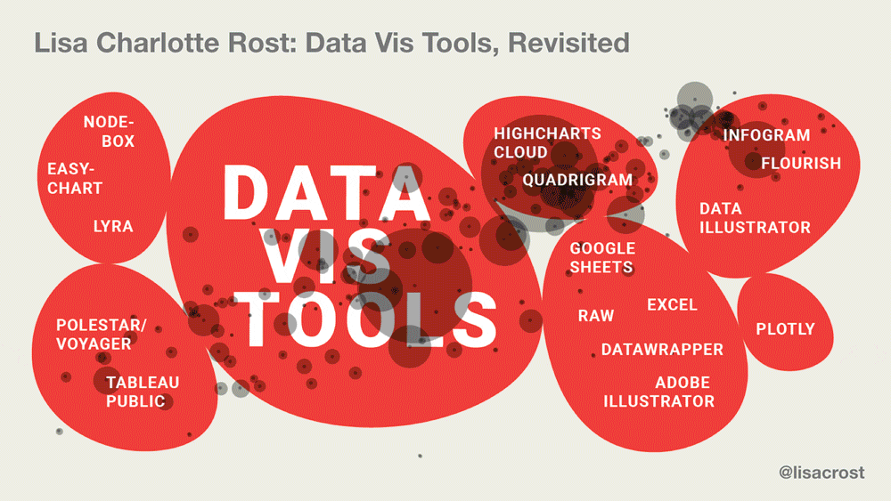
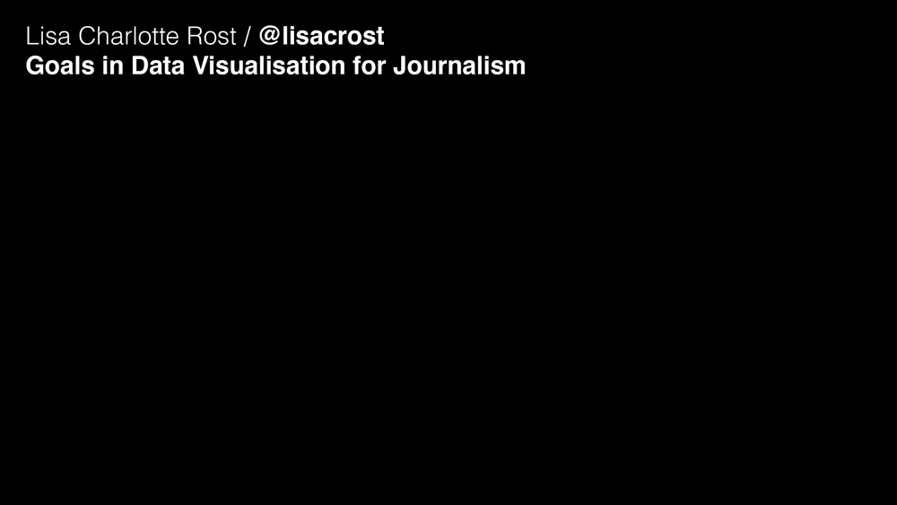

# Aaaaall my talk slides

(Almost) all my talks as GIFs and PDFs. There is still more to come; I’ll update it from time to time.

 
 

## Data Vis Tools, Revisited
[PDF](1810_DataVisToolsRevisited.pdf), ~~Transcript~~, ~~Recording~~ 
**Where?** [Vis in Practice](http://www.visinpractice.rwth-aachen.de/program.html) (“dedicated to everyone interested in the practical aspects of data visualization and visual analytics”) at [IEEE VIS](http://ieeevis.org/year/2018/welcome) ("the worldwide largest and most important conference on Scientific Visualization, Information Visualization and Visual Analytics") in Berlin, Germany 
**When?** October 2018 
**How long?** 30min 
**What?** Looking back at [lessons I've learned](https://source.opennews.org/articles/what-i-learned-recreating-one-chart-using-24-tools/) while recreating the same chart with 24 data vis tools in May 2016 and seeing if they still hold up. Introducing new developments in the tool landscape ("the rise of the data-drawing apps"), building empathy for tool builders and talking about my wishes for the future.

## Why you don’t believe in facts, and how to fix it
[PDF in English](1705_WhyYouDontBelieveInFacts.pdf), [PDF in German](1705_WhyYouDontBelieveInFacts_German.pdf),  [Transcript](https://lisacharlotterost.github.io/2017/05/07/why-do-we-not-believe-in-facts/), [Recording](https://www.youtube.com/watch?v=GnNazd3jZXU) 
**Where?** [Re:publica](https://re-publica.com/) (“The Most Exciting Festival for the Digital Society”) in Berlin, Germany 
**When?** May 2017 
**How long?** 20min 
**What?** Understanding why we believe so many stupid things, why we can’t get rid of beliefs easily and how to believe more true things.

  
## Why do you visualise data?
[PDF](1703_WhyDoWeVisualiseData.pdf), [Transcript](https://lisacharlotterost.github.io/2017/03/08/why-do-we-visualize-data/), Recording will follow 
**Where?** INCH (an information design conference) in Munich, Germany 
**When?** March 2017 
**How long?** 20min 
**What?** Thinking about possible goals of data vis and how to categorise them, and which industry has which goals when it comes to data vis.

  
## A data point walks into a bar
[PDF](1612_ADatpointWalksIntoABar.pdf), [Transcript](https://lisacharlotterost.github.io/2016/12/27/datapoint-in-bar/), [Recording](https://media.ccc.de/v/33c3-7999-a_data_point_walks_into_a_bar) 
**Where?** Chaos Communication Congress in Hamburg (Germany) 
**When?** December 2016 
**How long?** 20min 
**What?** Explaining why people are bad with high numbers, and that we feel more grief about the death of one person than about the death of thousands. Presenting possible ways how data vis could make us feel things even if it visualises big quantities.

  
## Making maps popular again
[PDF](1611_MakingMapsPopularAgain.pdf), [Transcript](https://lisacharlotterost.github.io/2016/10/19/election-map/),  ~~Recording~~ 
**Where?** GeoNYC meetup in New York City 
**When?** November 2016 
**How long?** 20min 
**What?** Thinking about how electoral college maps only show the “winner” votes per state, and how that can be solved with a map of the popular vote.

  
## Map Poetry
[PDF](1610_MapPoetry.pdf), [Transcript](https://lisacharlotterost.github.io/2016/10/21/mappoetry/), ~~Recording~~ 
**Where?** NACIS (a mapping conference) in Colorado Springs 
**When?** October 2016 
**How long?** 20min 
**What?** Thinking about maps that represent maps, not territories. Thinking about what map poetry can offer us and arguing that we should do that more.

  
## Github Tutorial
[PDF](1608_GithubTutorial.pdf), ~~Transcript~~, ~~Recording~~ 
**Where?** Hacks/Hacker Media Party in Buenos Aires 
**When?** September 2016 
**How long?** 60min tutorial with Christine Zhang 
**What?** Small Github Tutorial that explains basic principles like forking and branching in a visual way.

  
## More Context, Less News
[PDF](1606_LessNewsMoreContext.pdf), [Transcript](https://lisacharlotterost.github.io/2016/06/16/less-news-more-context/), [Recording](https://vimeo.com/179976639) 
**Where?** Information+ in Vancouver 
**When?** June 2016 
**How long?** 5min 
**What?** Lightning Talk that questions the role of news graphics.

  
## Thinking Tools
[PDF](1605_ThinkingTools.pdf), ~~Transcript~~, ~~Recording~~ 
**Where?** At NPR, for the NPR Visuals Team 
**When?** May 2016 
**How long?** 20-30min 
**What?** Explaining my “thinking tools”. Covers Parkinson’s Law, 80/20, Eisenhower Matrix, Morphological Matrix.

  
## Why What How
[PDF](1510_WhyHowWhat.pdf), ~~Transcript~~, ~~Recording~~ 
**Where?** Mozfest in London, just for the other OpenNews fellows. I actually never gave this talk; I just prepared it. 
**When?** November 2015 
**How long?** 5min 
**What?** Explaining the “Golden Circle” by Simon Sinek and how it relates to data vis.

  
## What Lisa likes
[PDF](1409_WhatLisaLikes.pdf), ~~Transcript~~, ~~Recording~~ 
**Where?** Talk for my co-workers at Onlab, a design studio in Berlin I worked for in 2014. 
**When?** September 2014 
**How long?** 20min 
**What?** Explaining what I like. Categories the things I like into “sorting knowledge”, “sorting ideas”, “sorting personalities”, “rethinking things”, “doing more in less time”. Please note that the talk is several years old; my opinion has definitely changed.

  
## Presentation of my master’s thesis about editorial design
[PDF](1407_MastersThesis.pdf), ~~Transcript~~, ~~Recording~~  
**Where?** In the office of my professor, Berlin  
**When?** August 2014 
**How long?** 60min 
**What?** Answering the question “Can I improve my design through feedback?”. I designed three different-looking magazines with the same content and got the feedback from lots of people.

